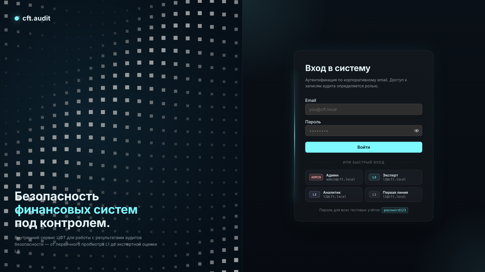

<div align="center">

# cft.audit

Внутренний сервис для работы с результатами аудитов безопасности финансовых систем.


</div>

## Демо

Задеплоено на собственный VPS, доступно без VPN:

**→ <http://85.198.108.217/login>**

Тестовые учётки указаны под формой входа — нажатие на карточку подставляет email+пароль.



## Про задачу

Тестовое задание от **[ЦФТ](https://www.cft.ru/)** (Центр Финансовых Технологий) — крупная российская ИТ-компания, разработчик ПО для банков и финансовых рынков.

Суть — собрать внутренний веб-сервис, в котором аналитики компании работают с результатами аудитов безопасности финансовых систем: смотрят записи, фильтруют, меняют статус, комментируют, строят аналитику и считают риск-скор / SLA / соответствие через встроенные калькуляторы. Доступ — только для сотрудников, роли четыре (ADMIN, L1, L2, L3) с разным объёмом прав.

## Что реализовано

- **Авторизация + RBAC** — 4 роли с матрицей прав. Проверка на server actions (источник правды) + UI-гейтинг кнопок.
- **Список аудитов** — URL-state поиск, фильтры-popover по критичности / статусу / системе / ответственному / диапазону дат, сортировка, пагинация, prefetch карточки по ховеру.
- **Карточка аудита** — детали, комментарии, timeline истории действий, role-gated операции (смена статуса — L2+, смена критичности + подтверждение решения — L3+).
- **Дашборд** — 4 stat-тайла + динамика обнаружения/устранения + донут по критичности + бары по статусам и топ-10 систем, расширенная аналитика для L3+.
- **Калькуляторы** — Риск / SLA / Соответствие. Все чистые функции, покрыты юнит-тестами.
- **Управление пользователями** — просмотр, inline-смена роли, модалка с описанием прав каждой роли, создание юзера (ADMIN-only).
- **Светлая / тёмная тема** — переключатель в шапке, весь UI на CSS-переменных.

## Быстрый старт

```bash
docker compose up -d --build
```

Это соберёт образ, поднимет PostgreSQL, применит миграции и посеет тестовые данные. Сервис откроется на <http://localhost:3001>.

Если хочется разрабатывать — ниже.
